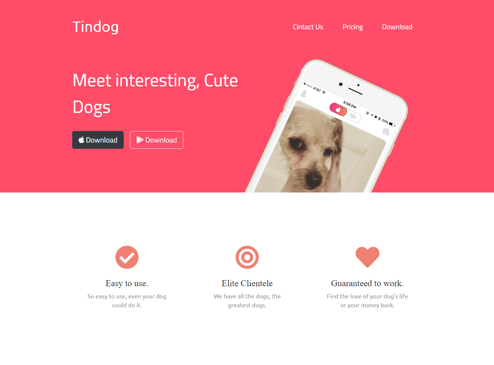
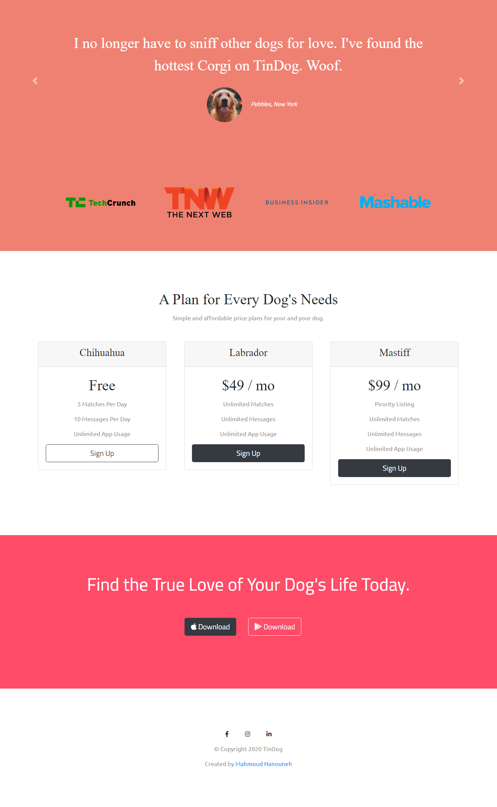

# Tindog - Fictional dogs dating app website

This is a simple website made during Angela Yu on Udemy 

## Table of contents

- [Overview](#overview)
  - [Screenshot](#screenshot)
  - [Links](#links)
- [My process](#my-process)
  - [Built with](#built-with)
  - [Useful resources](#useful-resources)
- [Author](#author)

## Overview

### Screenshot

### Links

- Live Site URL: (https://tindog-orpin.vercel.app/)

## My process

### Built with

- Semantic HTML5 markup
- CSS custom properties
- Responsive Bootstrap 4 Grid System
- Responsiveness with Media Queries

### Useful resources 

- [Bootstrap 4 Grid System](https://getbootstrap.com/docs/4.6/layout/grid/)

## Author

Mahmoud Hanouneh, I am a telecommunication engineer with a passion for learning web develop.

- LinkedIn - [Mahmoud Hanouneh](https://www.linkedin.com/in/mahmoud-hanouneh/)

